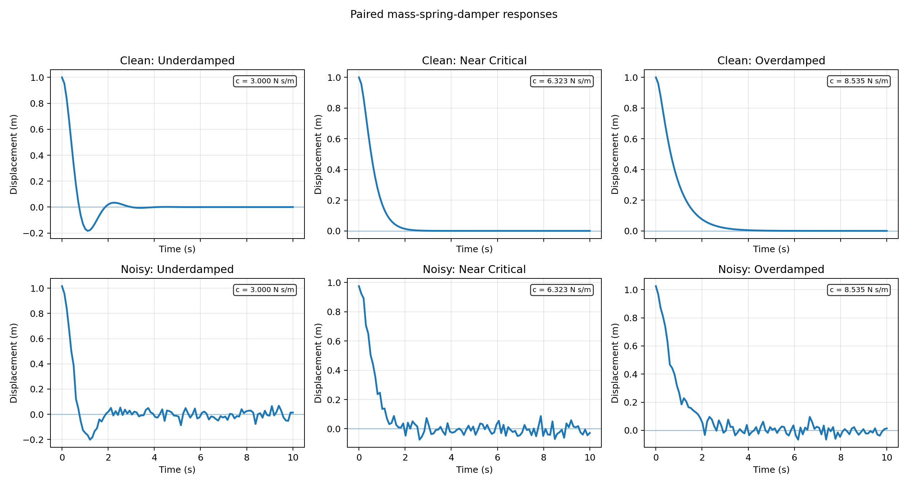
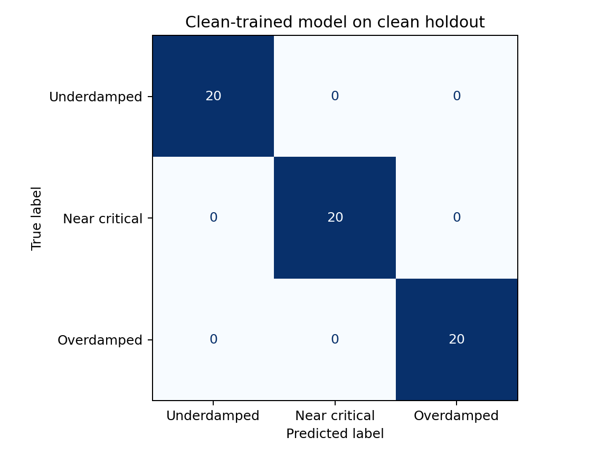
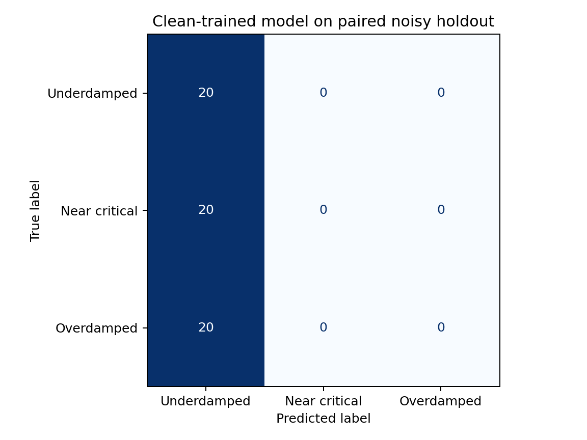
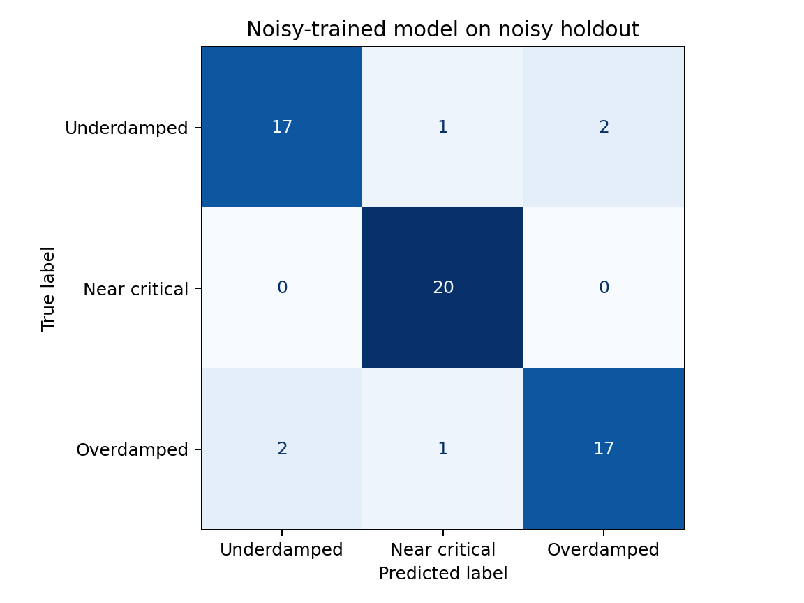

# Dynamic System Classification

This repository classifies three damping-coefficient bands from synthetic
mass-spring-damper displacement responses. It uses five hand-designed signal
features and a Random Forest classifier.

The clean and noisy datasets are paired: every noisy response uses the same
damping coefficient and sample ID as its clean counterpart. This makes the
clean-to-noisy evaluation a direct test of distribution shift rather than a
comparison between independently sampled datasets.

## Results

The committed results come from 300 simulated parameter samples, each represented
by a clean and a paired noisy response. Evaluation uses a seeded 80/20 split and
additive Gaussian noise with a standard deviation of `0.03 m`.

| Scenario | Training data | Test data | Accuracy | Macro F1 |
|---|---|---|---:|---:|
| Clean holdout | Clean | Clean | 1.000 | 1.000 |
| Clean-to-noisy transfer | Clean | Paired noisy | 0.333 | 0.167 |
| Noisy holdout | Noisy | Noisy | 0.900 | 0.899 |

The perfect clean score should be interpreted narrowly. The classes are
well-separated synthetic parameter bands generated from one fixed system. More
importantly, the clean-trained model falls to chance-level accuracy on the paired
noisy holdout. Training on noisy samples recovers much of the performance, but
that is an in-distribution result and not evidence of hardware robustness.

The exact values are stored in
[`results/evaluation_metrics.csv`](results/evaluation_metrics.csv).

## Model and labels

The simulated free response follows

```text
m x'' + c x' + k x = 0
```

with:

- mass `m = 1 kg`
- spring constant `k = 10 N/m`
- initial displacement `x(0) = 1 m`
- initial velocity `x'(0) = 0 m/s`
- duration `10 s` with 100 samples

The critical damping coefficient is

```text
c_critical = 2 sqrt(m k) = 6.3246 N s/m
```

Samples are drawn from these deliberately separated bands:

| Label | Damping coefficient range |
|---|---|
| `underdamped` | `0.5` to `c_critical - 0.5 N s/m` |
| `near_critical` | `c_critical ± 0.1 N s/m` |
| `overdamped` | `c_critical + 0.5` to `c_critical + 4.0 N s/m` |

`near_critical` is a tolerance band around the boundary, not a claim that every
sample has exactly critical damping.

## Features

The damping coefficient and damping ratio are retained as simulation metadata but
are not given to the classifier. The model uses only:

- maximum absolute displacement
- final absolute displacement
- mean absolute displacement
- response standard deviation
- zero-crossing count



## Evaluation design

The random seed is `42`. Stratified splitting selects the same 60 held-out sample
IDs for the clean and noisy datasets.

Three evaluations are produced:

1. a model trained on clean training samples and tested on clean held-out samples;
2. the same clean-trained model tested on the paired noisy versions of those
   held-out samples;
3. a separate model trained on noisy training samples and tested on noisy held-out
   samples.

No held-out sample, clean or noisy, is used to fit its corresponding model.

| Clean holdout | Clean-to-noisy transfer | Noisy holdout |
|---|---|---|
|  |  |  |

## Reproduce

```bash
python3 -m venv venv
source venv/bin/activate
python -m pip install -r requirements.txt
python src/main.py
python -m unittest discover -s tests -v
```

The pipeline regenerates the four CSV datasets, three confusion matrices,
response gallery, and evaluation metrics.

## Repository layout

```text
data/       simulated responses and extracted features
results/    metrics and generated figures
src/        simulation, feature extraction, evaluation, and plotting
tests/      reproducibility and evaluation checks
```

## Limitations

- All responses are simulated; no sensor or hardware data is included.
- Mass, spring constant, initial state, duration, and noise level are fixed.
- The parameter bands contain gaps and are easier than a boundary-classification
  problem.
- Results use one seeded split and one classifier, not repeated cross-validation.
- The noise is independent additive Gaussian noise and does not represent sensor
  bias, drift, timing error, or correlated disturbances.
- The clean-to-noisy result shows that these simple features are not invariant to
  the chosen noise model.

## License

MIT License. See [`LICENSE`](LICENSE).
